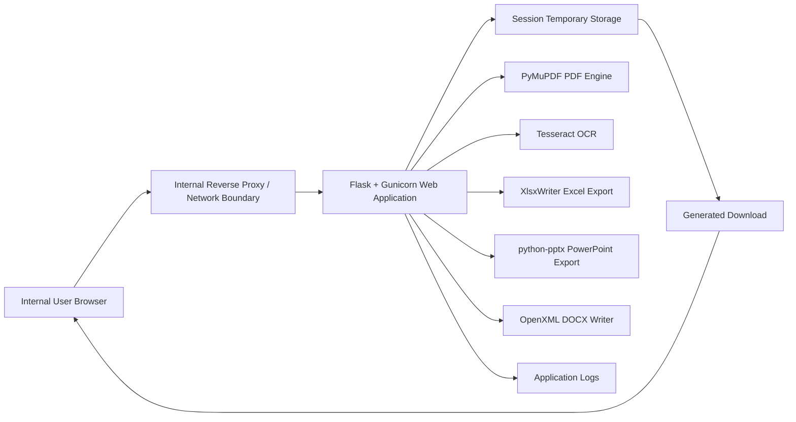
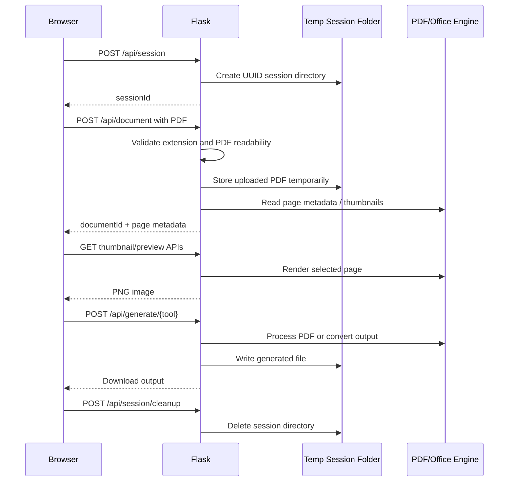
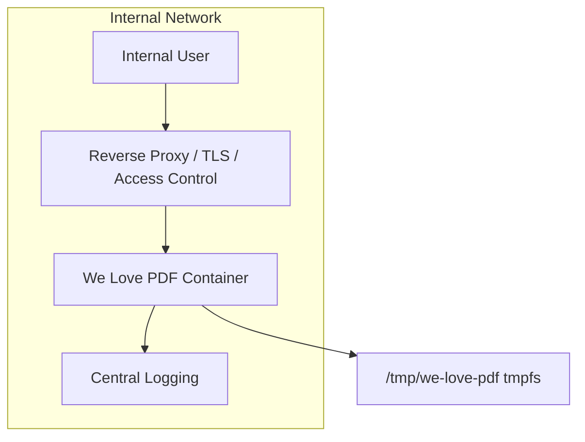

# We Love PDF Technical Architecture

## 1. Purpose

We Love PDF is an internal web application for day-to-day PDF operations on a trusted private network. It provides browser-based tools for merging, splitting, compressing, organizing, redacting, editing, and converting PDFs without user login and without persistent document storage.

The application is designed around temporary session-based processing. Uploaded PDFs and generated outputs are stored only in short-lived server-side temporary folders and are removed by browser-triggered cleanup and server-side TTL cleanup.

## 2. Functional Scope

The current application supports:

- Merge PDF
- Split PDF
- Compress PDF
- Organize PDF
- Redact PDF
- PDF Editor
- PDF to Excel
- PDF to Word
- PDF to PPT

## 3. High-Level Architecture



## 4. Runtime Components

| Component | Purpose | Open Source |
| --- | --- | --- |
| Python 3.13 | Application runtime | Yes |
| Flask 3.1.3 | Web framework and HTTP routing | Yes |
| Gunicorn 25.3.0 | Production WSGI server | Yes |
| PyMuPDF 1.27.2.3 | PDF parsing, rendering, manipulation, redaction, extraction | Yes |
| Tesseract OCR | OCR for scanned PDF text search during redaction | Yes |
| XlsxWriter 3.2.9 | Formatted `.xlsx` generation | Yes |
| python-pptx 1.0.2 | Valid `.pptx` generation | Yes |
| SortableJS | Browser drag-and-drop ordering | Yes |
| HTML/CSS/JavaScript | Frontend UI | Web standards |
| Docker | Container packaging | Open-source ecosystem |

## 5. Source Code Layout

```text
.
├── app.py                  # Flask app, API routes, PDF processing, conversion logic
├── Dockerfile              # Container image definition
├── docker-compose.yml      # Hardened local/container deployment profile
├── requirements.txt        # Python dependency pins
├── static/
│   ├── app.js              # Browser-side tool flow, preview, drag/drop, editor controls
│   ├── styles.css          # Application UI styling
│   └── vendor/
│       └── Sortable.min.js # Local SortableJS asset
├── templates/
│   └── index.html          # Shared home/tool page template
└── tests/
    └── smoke_test.py       # Functional smoke tests
```

## 6. Request Flow



## 7. Frontend Architecture

The frontend is a single shared template with mode-specific behavior driven by the active tool URL.

Important browser-side responsibilities:

- Tool selection and navigation
- PDF upload through `/api/document`
- Thumbnail preview rendering
- Drag/drop ordering using SortableJS
- Split range selection
- Redaction mark review
- PDF editor object placement, movement, resizing, formatting, and deletion
- Generate/download flow
- Completion modal after successful download
- Session cleanup on browser unload

The frontend avoids external CDNs. JavaScript and vendor libraries are served from the local application.

## 8. Backend Architecture

The backend is a Flask application in `app.py`.

Primary backend responsibilities:

- Session creation and cleanup
- Upload validation
- Temporary file management
- PDF thumbnail and preview rendering
- PDF manipulation through PyMuPDF
- OCR-assisted redaction search through Tesseract/PyMuPDF integration
- Output generation and download
- Security headers
- Operation and page-count limits
- Log redaction for session IDs and filenames

Important API groups:

| API | Purpose |
| --- | --- |
| `POST /api/session` | Create temporary session |
| `POST /api/session/cleanup` | Delete temporary session data |
| `POST /api/document` | Upload and validate PDF |
| `GET /api/document/{session}/{document}/thumbnail/{page}` | Render page thumbnail |
| `GET /api/document/{session}/{document}/preview/{page}` | Render larger preview |
| `POST /api/generate/{tool}` | Generate output for selected tool |
| `POST /api/redact/search` | Search text/OCR matches for redaction |

## 9. PDF Processing Design

PyMuPDF is the core PDF engine. It is used for:

- Opening and validating PDFs
- Counting pages
- Rendering thumbnails and previews
- Merging PDFs
- Splitting page ranges
- Reordering pages
- Rotating pages
- Creating blank pages
- Applying redactions
- Adding text, shapes, highlights, comments, and images
- Extracting text, words, spans, positions, colors, and image references

Operations are bounded by:

- Maximum upload size
- Maximum PDF page count
- Maximum OCR page count
- Cooperative operation timeout
- Gunicorn worker timeout
- Container CPU/memory/PID limits when deployed with Docker Compose

## 10. Conversion Architecture

### PDF to Excel

PDF to Excel uses a profile-first extraction path. Each selected page is inspected before conversion so the application can choose the best strategy instead of forcing every PDF into a single-column text export.

The current scenarios are:

- Ruled tables: detects horizontal and vertical drawing lines, clusters them into a grid, assigns text into cells, and preserves borders/merged cells.
- Aligned text tables: detects repeated text columns even when the PDF has no visible table borders.
- Form/key-value layouts: preserves labels and values across multiple columns instead of collapsing the form into one column.
- Visual text pages: uses approximate page coordinates to retain left/right text placement.
- Scanned or image-only pages: preserves a rendered page image in Excel and adds a note that selectable table text was not available.

The conversion flow is:

1. Read PDF text words, spans, colors, font flags, images, and drawing lines through PyMuPDF.
2. Profile each page for text density, recurring columns, grid lines, images, and scanned/image-only patterns.
3. Select the best conversion strategy for that page.
4. Apply page rotation matrix so landscape/rotated PDFs align correctly.
5. Write the workbook using XlsxWriter with formatting, spacing, and images.

The Excel pipeline preserves:

- Borders
- Row heights
- Column widths
- Text color
- Bold/italic styling
- Wrapped text
- Embedded images such as logos

This is optimized for complex tabular PDFs such as statutory reports, payroll reports, EPF/ECR-style reports, invoices, grid-heavy statements, and mixed form/table PDFs.

### PDF to Word

PDF to Word generates `.docx` using OpenXML package XML.

It preserves:

- Extracted text
- Basic bold/italic styling
- Table-like rows and cells
- Embedded images
- Page separation

### PDF to PPT

PDF to PPT uses python-pptx to generate valid PowerPoint packages.

It preserves:

- One selected PDF page per slide
- Embedded PDF images/backgrounds
- Text overlaid above images
- Text position based on PDF span coordinates
- Text color, including white/light text on dark backgrounds
- Bold/italic styling

## 11. Temporary Storage Model

The application does not use a database.

Temporary storage layout:

```text
{APP_TEMP_ROOT}/we-love-pdf/
└── {session-uuid}/
    ├── uploaded PDFs
    ├── rendered/generated intermediate files
    └── generated outputs
```

Cleanup mechanisms:

- Browser calls `/api/session/cleanup` during unload using `sendBeacon`.
- Server deletes expired sessions before request handling based on `SESSION_TTL_MINUTES`.
- Container deployment confines writable data to `/tmp`.

## 12. Security Architecture

### Security Controls

- No persistent document storage
- Server-side PDF validation
- Page-count limit through `MAX_PDF_PAGES`
- Upload-size limit through `MAX_UPLOAD_MB`
- OCR page limit through `MAX_OCR_PAGES`
- Cooperative operation timeout through `MAX_OPERATION_SECONDS`
- Generic user-facing OCR and browser errors
- Redacted logging for session IDs and filenames
- Locally served JavaScript and vendor libraries
- Security headers:
  - `X-Content-Type-Options`
  - `X-Frame-Options`
  - `Referrer-Policy`
  - `Permissions-Policy`
  - `Cache-Control`
  - Content Security Policy

### Container Hardening

The Docker Compose profile includes:

- Read-only root filesystem
- tmpfs-mounted `/tmp`
- `noexec`, `nosuid`, `nodev` tmpfs flags
- Dropped Linux capabilities
- `no-new-privileges`
- PID limit
- Memory limit
- CPU limit
- Non-root runtime user

### Deployment Boundary

The app is designed for a trusted internal network. Recommended production placement:

- Internal reverse proxy with HTTPS
- Firewall or proxy IP allowlisting
- Internal DNS only
- No direct public internet exposure
- Centralized access and application logging

## 13. Configuration

| Variable | Default | Description |
| --- | --- | --- |
| `MAX_UPLOAD_MB` | `150` | Maximum upload request size in MB |
| `APP_TEMP_ROOT` | OS temp + `we-love-pdf` | Temporary session storage root |
| `SESSION_TTL_MINUTES` | `60` | Temporary session lifetime |
| `MAX_PDF_PAGES` | `300` | Maximum allowed pages in one PDF |
| `MAX_OCR_PAGES` | `25` | Maximum OCR pages per redaction search |
| `MAX_OPERATION_SECONDS` | `120` | Cooperative server-side operation budget |
| `GUNICORN_WORKERS` | `2` | Production worker count |
| `GUNICORN_TIMEOUT` | `150` | Gunicorn hard timeout |
| `GUNICORN_GRACEFUL_TIMEOUT` | `20` | Gunicorn graceful shutdown timeout |
| `TESSDATA_PREFIX` | System default | Tesseract language data path |
| `PORT` | `8000` | Local Flask development port |

## 14. Deployment Architecture



Recommended production command inside container:

```bash
gunicorn -w ${GUNICORN_WORKERS:-2} \
  -b 0.0.0.0:8000 \
  --timeout ${GUNICORN_TIMEOUT:-150} \
  --graceful-timeout ${GUNICORN_GRACEFUL_TIMEOUT:-20} \
  --max-requests 100 \
  --max-requests-jitter 20 \
  --worker-tmp-dir /tmp \
  app:app
```

## 15. Observability

Current logging covers:

- Session creation and cleanup
- Generate events by tool
- Merge/compress/redact outputs
- Validation and request errors
- OCR unavailability
- Image extraction skips

Sensitive values are reduced:

- Session IDs are hashed/truncated before logging.
- Filenames are hashed before logging in processing logs.

Recommended production additions:

- Reverse proxy access logs
- Per-tool latency metrics
- Upload size and page-count metrics
- Error-rate monitoring
- Container CPU/memory monitoring
- Alerting on repeated invalid uploads or timeouts

## 16. Known Constraints

- No login is implemented by design; perimeter controls are required.
- PDF conversion fidelity depends on the source PDF structure.
- Scanned PDFs require OCR for text extraction; conversion tools are strongest with selectable-text PDFs.
- Complex PDF layouts may require per-document tuning.
- PDF parsing/conversion currently runs in the web worker process.

## 17. Recommended Future Enhancements

- Isolate PDF processing in a separate worker container.
- Add reverse-proxy rate limiting.
- Add optional internal SSO or reverse-proxy authentication.
- Add antivirus/CDR scanning for uploaded documents if required by policy.
- Add structured JSON logs.
- Add CI scans:
  - `pip-audit`
  - Bandit
  - Container image scanner such as Trivy or Grype
- Add visual regression samples for complex conversion files.
- Add OCR-assisted table extraction for scanned PDFs.
